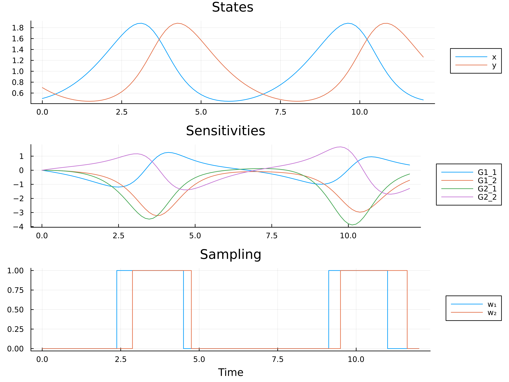

# Summary

Optimum experimental design (OED) problems are typically encountered when unknown or uncertain
parameters of mathematical models are to be estimated from an observable, maybe even controllable, process. In this scenario, OED can be used to decide on an experimental setup before collecting the data, i.e., deciding on when to measure and / or how to stimulate a dynamic process in order to maximize the amount of information gathered such that the parameters can be accurately estimated.

Our software package DynamicOED.jl facilitates the solution of optimum experimental design problems for dynamical systems. Following ideas presented in [@Sager2013], we cast the OED problem into an optimal control problem. This is done by augmenting the user-provided system of ordinary differential equations (ODE) or differential algebraic equations (DAE) with their variational differential (algebraic) equations and the differential equation governing the evolution of the Fisher information matrix (FIM). A suitable criterion based on the FIM is then optimized in the resulting optimal control problem using a direct *first discretize, then optimize* approach.

# Statement of need

`DynamicOED.jl` is a Julia [@bezanson2017julia] package for solving optimum experimental design problems. Solving OED problems is of interest for several reasons. First, all model-based optimization strategies rely on the knowledge of the accurate values of the model's parameters. Second, computing optimal experimental designs before performing the actual experiments to collect data allows to reduce the number of needed experiments or measurements. This is important in practical applications when measuring quantities of interest is only possible to a limited extent, e.g., due to high costs of performing the measurements. 

Our package is designed for high flexibility and ease of use. For formulating the underlying dynamical system, our package bases on the `ODESystem` from `ModelingToolkit.jl` [@ma2021modelingtoolkit]. This enables researchers and modelers to easily investigate and analyze their models and allows them to collect insightful data for their parameter estimation problems. 

To our knowledge it is the first dedicated package for solving general optimal experimental design problems with dynamical systems written in the programming language Julia. It may therefore be a valuable resource to different communities dealing with experimental data and parameter estimation problems.

# Problem statement and usage example

The problem we are interested in solving reads
$$
\begin{array}{clcll}
\displaystyle \min_{x, G, F, z, w } 
& \multicolumn{3}{l}{ \phi(F(t_f))} &  \\[1.5ex]
\mbox{s.t.}     & 0  & = & f(\dot x(t), x(t), u(t), p) \\  
                & 0  & = & f_{\dot x}(\dot x(t), x(t), u(t), p) \dot{G}(t) + f_x(\dot x(t), x(t), u(t), p)G(t) \\
                &    &    & + f_p(\dot x(t), x(t), u(t), p), \\
                & \dot{F}(t)  & = & \sum_{i=1}^{n_h} w_i(t) (h^i_x(x(t)) G(t))^\top (h^i_x(x(t)) G(t)), \\
                & \dot{z}(t)  & = & w,\\
                & x(0)        & = & x_0, \quad  G(0) = 0, \quad F(0) = 0, \quad z(0) = 0,\\
                & u(t)        & \in & \mathcal{U},\\
                & w(t)        & \in & \mathcal{W},\\ 
                & z(t_f) - M  & \leq & 0,
\end{array}
$$
where $\mathcal{T} = [t_0, t_f]$ is the fixed time horizon and $x : \mathcal{T} \mapsto \mathbb{R}^{n_x}$ are the differential states. The first and second constraint denote the dynamical system and the sensitivities of the solution of the dynamical system with respect to the uncertain parameters, respectively, and are given in an implicit form. Here, $f_{\dot x}$, ($f_x$) denote the partial derivative of $f$ with respect to $\dot x$ and ($x$). The objective $\phi(F(t_f))$ of Bolza type is a suited objective function, e.g., the D-criterion $\phi(F(t_f)) = \det(F^{-1}(t_f))$. The evolution of the symmetric FIM $F : \mathcal{T} \mapsto \mathbb{R}^{n_p \times n_p}$ is governed by the measurement function $h: \mathbb{R}^{n_x} \mapsto \mathbb{R}^{n_h}$, the sensitivities $G : \mathcal{T} \mapsto \mathbb{R}^{n_x \times n_p}$ and the sampling decisions $w(t) \in \{0,1\}^{n_h}$. The latter are the main optimization variables and represent the decision whether to measure at a given time point or not. In our direct approach, these variables are discretized, hence we write $w(t) \in \{0,1\}^{N_w \times n_h}$, where $N_w$ is the (user-supplied) number of discretization intervals on $\mathcal{T}$. The sampling decisions are then accumulated in the variables $z$ and constrained by $M \in \mathbb{R}^{n_h}_{+}$. The controls $u \in \mathcal{U}$ can either be fixed or also be viewed as optimization variables after discretization.

For more information on optimal experimental design for DAEs and their sensitivity analysis, we refer to [@Koerkel2002; @Li2000SensitivityAnalysisDifferential]. 

The functionality in this package integrates into Julia's [`SciML`](https://sciml.ai/) ecosystem. The model is provided in symbolic form as an `ODESystem` using `ModelingToolkit.jl`[@ma2021modelingtoolkit] with additional frequency information for the observed and control variables. Both ODE or DAE systems can be provided. `DynamicOED.jl` augments the given system symbolically with its sensitivity equations and the dynamics of the FIM. The resulting system together with a sufficient information criterion defines an `OEDProblem`, solveable using `DifferentialEquations.jl` [@rackauckas2017]. Here, all sampling and control decisions are discretized in time and can be used to model additional constraints. At last, the `OEDProblem` can be transformed into an `OptimizationProblem` as a sufficient input to `Optimization.jl` [@vaibhav_kumar_dixit_2023_7738525]. Here, a variety of optimization solvers for nonlinear programming and mixed-integer nonlinear programming available as additional backends, e.g. `Juniper` [@juniper] or `Ipopt` [@Waechter2006]. A simple example demonstrates the usage of `DynamicOED.jl` for the Lotka-Volterra system [@Sager2013]. 

\autoref{fig:lotka} shows the solution of the example above including the differential states, sensitivities $G$ and the sampling decisions $w$. More examples can be found in the [documentation](https://mathopt.github.io/DynamicOED.jl/dev/). 

\newpage

```julia
using DynamicOED
using ModelingToolkit
using Optimization, OptimizationMOI, Ipopt

@variables t
@variables x(t)=0.5 [description="Biomass Prey"] 
@variables y(t)=0.7 [description="Biomass Predator"]
@variables u(t) [description="Control"]
@parameters p[1:2]=[1.0;1.0] [description="Fixed Parameters", tunable=false]
@parameters p_est[1:2]=[1.0;1.0] [description="Tunable Parameters", tunable=true]
D = Differential(t)
@variables obs(t)[1:2] [description = "Observed", measurement_rate=96]
obs = collect(obs)

@named lotka_volterra = ODESystem(
    [
        D(x) ~   p[1]*x - p_est[1]*x*y;
        D(y) ~  -p[2]*y + p_est[2]*x*y
    ], tspan = (0.0, 12.0),
    observed = obs .~ [x; y]
)
@named oed_system = OEDSystem(lotka_volterra)
oed_problem = OEDProblem(structural_simplify(oed_system), DCriterion())

optimization_variables = states(oed_problem)

w1, w2 = keys(optimization_variables.measurements)

constraint_equations = [
    sum(optimization_variables.measurements[w1]) ≲ 32,
    sum(optimization_variables.measurements[w2]) ≲ 32,
]

@named constraint_system = ConstraintsSystem(
    constraint_equations, optimization_variables, Num[]
)

optimization_problem = OptimizationProblem(
    oed_problem, AutoForwardDiff(), constraints = constraint_system,
    integer_constraints = false
)

optimal_design = solve(optimization_problem, Ipopt.Optimizer();
                        hessian_approximation="limited-memory")

```
# Extensions

Several extensions are planned for the future. First, a multiple shooting approach is planned. Also, other steps to increase the efficiency of our implementation may be considered. For example, in the case of fixed initial values and controls, the integration of $x$ and $G$ need to be done only once and can be decoupled from the numerical integration of $F$ and the subsequent optimization over $w$. 




# Acknowledgements

The work was funded by the German Research Foundation DFG within the priority
program 2331 'Machine Learning in Chemical Engineering' under grants KI 417/9-1, SA
2016/3-1, SE 586/25-1

# References